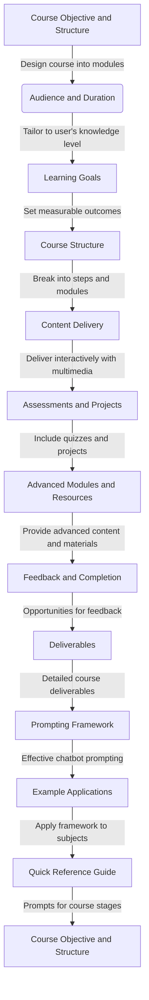

<p align="center"></p>

This document will walk you through the design decisions and structure of the updated <SwmPath>[README.md](/README.md)</SwmPath> file. The purpose of this README is to guide users in creating a personalized intensive course using a chatbot. The document is structured to be visually appealing and follows best practices for clarity and engagement.

We will cover:

1. The overall objective and structure of the course.
2. The step-by-step breakdown of modules and learning objectives.
3. The integration of interactive elements and assessments.
4. The use of feedback and supplementary resources.
5. The framework for prompting the chatbot effectively.

# Course objective and structure

<SwmSnippet path="/README.md" line="10">

---

The main objective is to create a personalized intensive course that takes the user from zero knowledge to expert level in a chosen subject. The course is broken down into modules with clear learning objectives, interactive lessons, and assessments.

```
Objective: Create a personalized 2-day intensive course to take me from 0 knowledge to expert level in a chosen subject.

Instructions:

Design and deliver a complete learning experience by breaking the course into modules, providing clear learning objectives, interactive lessons, and assessments. Teach each module step-by-step, integrating practical exercises, discussions, and multimedia resources.

Subject: [Insert subject you want to learn here]
```

---

</SwmSnippet>

# Audience and duration

<SwmSnippet path="/README.md" line="18">

---

The course is designed for the user, taking into account their current knowledge level and learning preferences. The duration is set to allow for an intensive learning experience, enabling the user to choose the timeframe they prefer.

```
<aside>
💡

Fill in your subject of choice 

</aside>

Audience: Me ([Describe your current knowledge level, e.g., beginner, no prior experience, some familiarity]).
```

---

</SwmSnippet>

# Learning goals

<SwmSnippet path="/README.md" line="45">

---

By the end of the course, the user should have an expert-level understanding and practical skills in the chosen subject. The goals are clearly defined to ensure measurable outcomes.

```
Goal: By the end of this course, I should have expert-level understanding and practical skills in [subject].

<aside>
💡

Put your subject and more information about how you want to use that skill if you would like. 

</aside>
```

---

</SwmSnippet>

# Course structure

<SwmSnippet path="/README.md" line="54">

---

The course is structured into several steps, starting with an introduction module that outlines the course structure, learning outcomes, and expectations.

```
Structure the Course as Follows:

Step 1: Introduction Module

1. Explain the course structure, learning outcomes, and expectations.
2. Provide an overview of the subject and its real-world applications.

Step 2: Main Modules
```

---

</SwmSnippet>

# Main modules and content delivery

<SwmSnippet path="/README.md" line="63">

---

Content is divided into logical modules, progressing from foundational concepts to expert-level topics. Each module includes learning objectives, content delivery with multimedia, practical exercises, and interactive elements.

```
1. Divide the content into logical modules, starting with foundational concepts and advancing to expert-level topics.
2. For each module:
- Learning Objectives: Define 3-5 measurable goals.
- Content Delivery:
- Teach core concepts with clear explanations and real-world examples.
- Include multimedia where applicable (e.g., diagrams, videos, or links).
- Practical Exercises: Provide hands-on tasks or scenarios to apply the concepts.
- Interactive Elements: Include discussion prompts or reflective questions.
```

---

</SwmSnippet>

# Assessments and projects

<SwmSnippet path="/README.md" line="72">

---

Assessments are integrated to test understanding, with quizzes and assignments for each module. Mid-course and final projects are designed to evaluate mastery of the subject.

```
Step 3: Assessments and Projects

1. Assess Understanding: Create quizzes or assignments for each module to test my knowledge.
2. Mid-Course Project: Design an assignment that integrates concepts from the first half of the course.
3. Final Project: Create a capstone task that evaluates my mastery of the subject.

Step 4: Advanced Modules
```

---

</SwmSnippet>

# Advanced modules and supplementary resources

<SwmSnippet path="/README.md" line="80">

---

Advanced modules build on earlier concepts with complex exercises and discussions. Supplementary resources are provided for further learning, including textbooks and online materials.

```
1. Build on earlier concepts with advanced-level content and challenges.
2. Include complex practical exercises and deeper discussions.
3. Assess learning with case studies, problem-solving tasks, or detailed projects.

Step 5: Supplementary Resources

1. Provide a list of recommended textbooks, online materials, and tools for further learning.
2. Include a glossary of key terms introduced during the course.
```

---

</SwmSnippet>

# Feedback and completion

<SwmSnippet path="/README.md" line="89">

---

Opportunities for feedback are included, along with a customizable course completion certificate. The teaching plan emphasizes a conversational style and adaptability based on user engagement.

```
Step 6: Feedback and Completion

1. Include opportunities for me to provide feedback on the course experience.
2. Offer a customizable course completion certificate based on defined success criteria.

Teaching Plan

1. Teach each module in a conversational style, pausing to confirm understanding and answer questions.
2. Provide clear transitions between modules, summarizing key takeaways before moving forward.
3. Adjust pacing and depth based on my responses and engagement.
```

---

</SwmSnippet>

# Deliverables

<SwmSnippet path="/README.md" line="100">

---

The course deliverables include a complete, personalized learning experience with interactive chat delivery, practical assignments, detailed explanations, and feedback opportunities.

```
Deliverables:

- A complete, personalized course delivered interactively over chat.
- Clear and practical assignments for hands-on learning.
- Detailed explanations and resources to reinforce understanding.
- Feedback opportunities and a final course evaluation.

## Example full prompt
```

---

</SwmSnippet>

# Prompting framework

<SwmSnippet path="/README.md" line="180">

---

A generalized follow-up prompt framework is provided to guide users in interacting with the chatbot. This includes starting modules, reviewing content, applying practical exercises, and seeking feedback.

```
## Generalized Follow-Up Prompt Framework

Here's how you can prompt the chatbot for any subject while maintaining flexibility and depth:

### Starting or Moving Forward

**Prompt Options:**
```

---

</SwmSnippet>

# Example applications

<SwmSnippet path="/README.md" line="244">

---

Examples are provided to illustrate how the framework can be applied to various contexts, such as public speaking, graphic design, and startup validation.

```
### Public Speaking Example

- **Module 1:** *"I'm ready to start Module 1: The Foundations of Public Speaking. Can you break it down step-by-step, provide examples, and include a practice task?"*
- **Review:** *"Can you summarize how to structure an effective speech and give me a short practice task?"*
- **Project:** *"Can you design a project where I write and deliver a 2-minute speech? Provide tips and evaluate my performance."*

### Graphic Design Example
```

---

</SwmSnippet>

# Quick reference guide

<SwmSnippet path="/README.md" line="262">

---

A quick reference guide is included to help users get the most value from the course, with prompts for starting modules, requesting reviews, seeking advanced learning, and planning next steps.

```
### Quick Reference Guide

To get the most value from this course, you can use the following prompts at any point:

- **Start a Module:** 'I'm ready for [Module Name]. Teach me step-by-step with examples.'
- **Request a Review:** 'Can you summarize [specific topic] and include a quick test?'
- **Ask for Hands-On Practice:** 'Give me a practical exercise on [topic].'
- **Seek Advanced Learning:** 'Can we go deeper into [concept] with a challenge?'
- **Request Feedback:** 'Here's my answer: [insert]. How did I do?'
- **Plan Next Steps:** 'What's next after this course? Recommend projects or paths.'
```

---

</SwmSnippet>



&nbsp;

<SwmMeta version="3.0.0" repo-id="Z2l0aHViJTNBJTNBbGVhcm5hbnl0aGluZyUzQSUzQWNvZGVkaWRpdA==" repo-name="learnanything"><sup>Powered by [Swimm](https://app.swimm.io/)</sup></SwmMeta>
